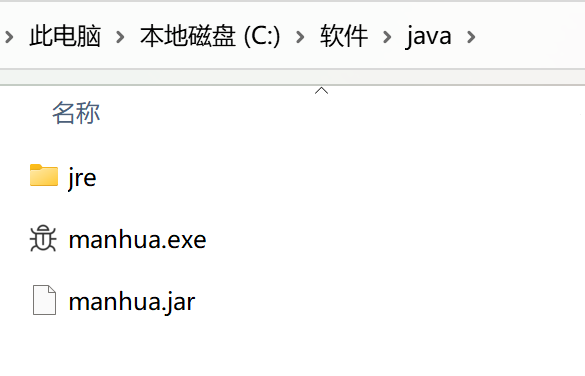

### 爬取漫画
::: tip 分析
网站结构还是挺简单的，基本上替换就可以了。但是流程很复杂，请看：
:::
- 封包，设置代理
- 请求页数。正则匹配含有页数的标签，提取***转换为数字存为集合***中，并***排序***，以确定最大页。
- 历列表页。列表页正则匹配出每一话漫画的id标示并存到Arraylist中。
- 拼接下载链接。遍历ArrayList的每一个漫画，存入***set集合以去重***。
- 输出到文件中或者sql中
- 使用***线程池，多线程***爬取漫画页。缩短到10s左右。
- 用 **CopyOnWriteArraySet** 并发容器防止快速失败，出现并发问题，和并发原子类 **AtomicInteger** 计数

@[code](manhua.java)


2023.6.17 更新
### 部署
- Java服务，一没有国外服务器，二国内云服务挂代理可能会被封。
- 移植到JavaScript，没有多线程，不太完美。移植到python,多此一举，且不熟悉
- 封装成.exe ，已经完成

整理一下思路：
- 用maven打成jar包，记得lib依赖也要有。如果不是boot项目推荐以下配置（如果没有打包lib的话）
- 会有两个jar包，一个就是带依赖的
``` xml
 <build>
    <plugins>
      <plugin>
        <groupId>org.apache.maven.plugins</groupId>
        <artifactId>maven-assembly-plugin</artifactId>
        <configuration>
          <archive>
            <manifest>
              <addClasspath>true</addClasspath>
              <mainClass>album</mainClass>                  //mian方法的类
            </manifest>
          </archive>
          <descriptorRefs>
            <descriptorRef>jar-with-dependencies</descriptorRef>
          </descriptorRefs>
        </configuration>
        <executions>
          <execution>
            <id>make-assembly</id>
            <phase>package</phase>
            <goals>
              <goal>single</goal>
            </goals>
          </execution>
        </executions>
      </plugin>
    </plugins>
  </build>
```


- 用exe4j打包的时候，记得勾选兼容64位，和移除自带的jre环境，自己新建一个文件夹，jar包和jre文件夹都放进去，让他勾选这个文件夹内的jre环境
  


### 现存bug
- 暂无
### 后续任务

- 不好接入前端，因为需要代理，就在控制台输入名字好了
