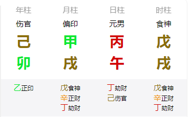
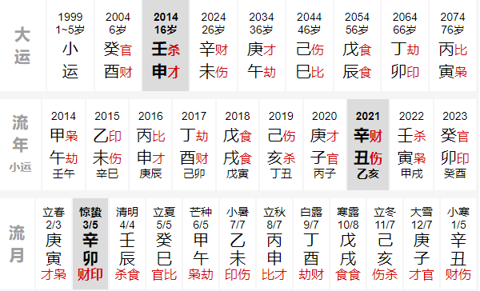
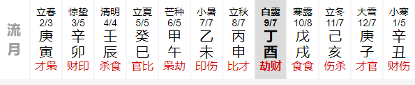
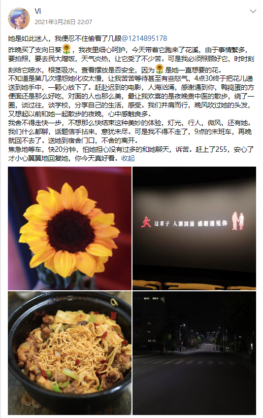
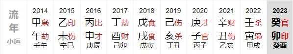

[[toc]]
## 资料来源
### 古籍三命通会
#### 为什么不选渊海子平呢？  
- 渊海确系是最早的四柱论命法，但是这本书更多是 **口诀理论** ，没有十分实际的断命技巧，需要自己有比较好的基础才能理解本意。且其中比较少发扬，扩展，不适合初学。
- 三命通会有不少来源其他命书的口诀，是一个大杂烩，但 **解释** 了很多口诀背后的命理，命例也很多，内容多可以自己取舍。
### 古籍滴天髓命
- 滴天髓的 **总体论命** 技巧有可取之处，如何总体把握一个八字，就可以看滴天髓。经常可以在里面看到 **气势**，顺逆，调侯，因一字成功，一字失败。
### 贴吧一卦大师
- 对十神，格局独有见解，说话很有趣，偏现代化。
### 黄大陆聊命理
- 另一个体系，真才实学，并非是抄袭或者胡编乱造，偏现代化。
### 子平真诠rain
- 子平真诠更多是发源于一本书【**沈氏用神例解**】，专门讲格局的，详细分析了各种成格变格，喜用变化。而这位雨大师，以现代化，扩展化的方式详细解释了子平真诠
### 现台湾梁湘润
- 如果你想更加细节和现代人谈命理，大到命运成就，小到生活琐事，选择这位研究者的学习更加妥当，他的体系可以说整合了各个方面的知识，也使用了统计学，可以了解到八字覆盖到的方方面面。

## 纲领
### 格局论顺逆
::: tip 善者善用，逆者逆用。因阴阳相生相克所以为善，同性而成恶。用之为宜，皆有成就。
举个例子，克日主之官杀，阴阳克之有情是谓节制，规劝之意。同而无情是为虐待，强迫。有情无情定之顺逆，所以正官喜得财生，或生印，生谓之有情。得财生者，即官得财生格局。生印者谓官印相生。
  
其中也有特殊的，比如食神是同性而善，财和印不是特别需要区分偏正。官杀是最需要区分的，再有就是劫财羊刃。食伤虽然可以同论，不过伤官喜印，食神喜日主和财或七杀也是需要区分的，一旦食伤混杂，优先取印。
:::
### 次日主强弱
::: tip 身弱不可担财绝对是谬误! 身强需克泄或者不喜印也不是绝对的。
日主强弱实际上要分为 **旺衰** 和 **强弱** ,看 **月令** 知旺衰，**坐支** 看强弱。
  
根据我的分析，不一定可靠，强弱看的是日主是否有 **自主权**，而旺衰更多看的是格局的 **配合**，日主能否去生泄，或受财官主要看就是坐支。  
举个例子，丙生在巳午月和坐巳午支的情况，在月令，月令看的是格局之需，禄了可以财官印都行，如果是刃，七杀最佳。如果是坐支，可以配合月令，受官杀财食伤。
 
:::
### 再看刑冲合
::: tip 地支本无交互，刑冲会合即是作用。
三合三会 > 半三合 > 六合 > 六冲 > 刑     

:::
### 日主论调侯
::: tip 第一优先级非必要不考虑调侯，如金水伤官，见官反为佳。其他可以作为层次上的参考。
调侯在于四个字， **燥湿寒暖**，尤其是土，辰丑是 **湿土**，未戌是 **燥土**，用于调侯的作用很大，其次是**丙午**两字对于寒湿的作用。
  
调侯是在于阴阳平衡，如果原局已经太过，宁愿不调侯，火至寒则熄，水至热则蒸。
:::
### 兼之论神煞
::: tip 神煞配合格局使用，层次和救应。
天乙配官印，天月配日主，桃花配夫妻星，羊刃配七杀。

:::

## 命盘

### 大运
### 感情
::: tip 辛金不一定是缘分，食伤当为妻
因为辛金是藏在戌中的，对我的格局来说非必需。  
食神格如果没有财，就不必生财。生财反而不佳。  
这里只是举个辛金流年流月出现比较典型的例子。
:::
  

2021年:  
**关键月份**  
**第一次**：3.5-4.5 莫名奇妙的远方之行。

  

**第二次**：9.7-10.7。9月实际上有三次，聚会拍照修手机。

  

**其他月份**：
总体来说她应该就是辛金了，3.4.5.8.9.10.12都有她的痕迹。         
其余时间要么放假了,要么比较特殊。不过还是3.9的感受最深。夜晚和拍照修手机。

**其他年份**：
虽然这期间有很多人，不过能带给我思念感觉的人。  
2017年11月附近应该就是大兄弟了，2018年辛酉月是桃子。

**庚金的运**：
庚金泛指的异性太多了，又和劫财有所混淆。不太好举某个例子。

### 学习
  
甲午乙未是大家心中的榜样，学业有成，春风得意。  
即使是甲午年，在学校有许多困境，依旧能靠自己自学奋发向上。（13的挫折）  
只不过乙未年，才是全面进步时候，太过完美回忆不起什么内容。（年级第一）

### 人际
最明显的还是 丁酉年 认识了超级多的异性朋友，以及学姐。差不多50个人。
其次 戊戌 火局 认识了非常多的学妹。
就不提那几个比较重要的学姐学妹了，经过我的推理，叶芬确实是劫财，因为重点都是5月份，丁巳月有所交集。  
我总算是明白了。

### 理想
我追寻到了自己的理想，那段时间非常享受，欲望大于天理。随心所欲。

### 