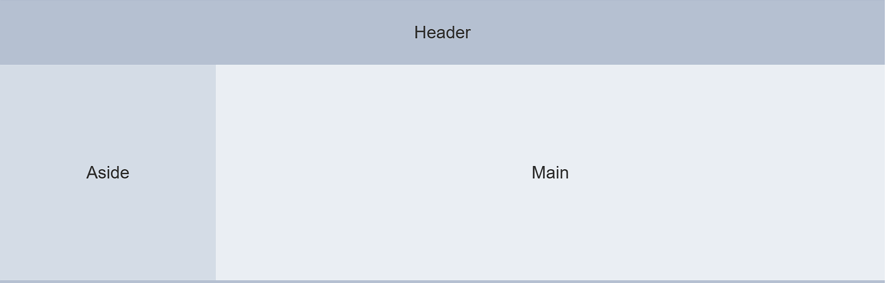
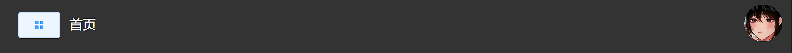

[[toc]]
# 包管理
``` javascript
 "dependencies": {
    "axios": "^1.4.0",
    "core-js": "^3.8.3",
    "echarts": "^5.1.2",
    "element-ui": "^2.15.13",
    "js-cookie": "^3.0.1",
    "less": "^4.1.2",
    "less-loader": "^6.0.0",
    "mockjs": "^1.1.0",
    "vue": "^2.6.14",
    "vue-router": "^3.6.5",
    "vuex": "^3.6.2",
    "yarn": "^1.22.19"
  }
```
# 配置文件
``` javascript
const CompressionWebpackPlugin = require('compression-webpack-plugin');
const productionGzipExtensions = ['js', 'css'];
const { defineConfig } = require('@vue/cli-service')

module.exports = defineConfig({
    transpileDependencies: true,
    publicPath:'./',    //打包路径
    lintOnSave:false,   //简单命名
    
    //压缩打包
    configureWebpack: config => {
        config.plugins.push(new CompressionWebpackPlugin({
            algorithm: 'gzip',
            test: new RegExp('\\.(' + productionGzipExtensions.join('|') + ')$'),
            threshold: 10240,
            minRatio: 0.8,
        }));
        config.devtool = false;
    },
      
    //移除非必要插件  
    chainWebpack: config => {
        config.plugins.delete("prefetch");
        config.plugins.delete('preload');
        config.optimization.minimize(true);
    },
},

```
# Main入口
::: tip 入口文件只做嵌入，顶栏，侧边栏，主体内容。直接copy
明白哪个位置应该放什么组件，包括子组件
:::
1.采用element-ui的Container布局，顶栏，侧边栏，主体内容确认大布局。
  
``` javascript
<template>
 <div>
<!--   布局（flex原理）-->

     <el-container>
<!--     边栏,组件封装-->
         <el-aside width="auto">
             <common-aside />
         </el-aside>
     <el-container>

<!--       导航，组件封装-->
       <el-header>
         <common-header />
       </el-header>

<!--       主体，使用路由出口-->
       <el-main>
         <router-view></router-view>
       </el-main>

     </el-container>
   </el-container>
 </div>
</template>

<script>

import CommonAside from "@/components/CommonAside.vue";
import CommonHeader from "@/components/CommonHeader.vue";
export default {
  data(){
    return{
    }
  },
  components:{
    CommonAside,
    CommonHeader
  }
}
</script>
```

## 通用组件

### 侧边栏组件
- 一/二级菜单
- 菜单图标巧用
- 菜单路由跳转
- 标题收起变化
#### 布局
::: tip 1.展开和收起的文字不一样，使用模板表达式和三元表达式控制属性
:::
``` vue
 <h3>{{ isCollapse ? "后台" : "后台管理系统" }}</h3>
```

::: tip 2.菜单名字和图标的遍历,用v-for
:::
``` javascript
<!--一级菜单-->
 <el-menu-item
      @click="clickMenu(item)"
      v-for="item in noChildren" :key="item.name" :index="item.name">
      <i :class="`el-icon-${item.icon}`"></i>
      <span slot="title">{{ item.label }}</span>
    </el-menu-item>
    
 <!--二级下拉菜单-->
    <el-submenu v-for="item in hasChildren" :key="item.label" :index="item.label">
      <template slot="title">
        <i :class="`el-icon-${item.icon}`"></i>
        <span slot="title">{{ item.label }}</span>
      </template>

      <!--下拉-->
      <el-menu-item-group v-for="subItem in item.children" :key="subItem.name">
        <el-menu-item
            @click="clickMenu(subItem)"
            :index="item.name">{{ subItem.label }}
        </el-menu-item>
      </el-menu-item-group>
    </el-submenu>
```
#### 数据
::: tip 数据中有嵌套的数据，使用计算属性分离出来，普通菜单和有子菜单。还有控制是否展开的数据，以及路由显示权限的数据
:::
``` javascript
computed: {
    //   没有子菜单
    noChildren() {
      return this.menuData.filter(item => !item.children)
    },
    //   有子菜单
    hasChildren() {
      return this.menuData.filter(item => item.children)
    },
    // 是否展开
    isCollapse() {
      return this.$store.state.tab.isCollapse
    },
    // 菜单显示控制
    menuData() {
      return JSON.parse(Cookie.get('menu')) || this.$store.state.tab.menu
    }
  }
```
#### 方法
::: tip 路由已经包含在数据中，通过点击参数传递过来，直接push跳转
但是有个条件，路由不一致才可以跳转或者不在首页/根目录才能跳转
:::
``` javascript
  // 点击路由跳转
  clickMenu(item) {
    // 仅当前路由不一致或者是首页是home的时候才允许,route是当前路由，router是实例
    if (this.$route.path !== item.path && !(this.$route.path === '/home' && (item.path === '/'))) {
      this.$router.push(item.path)
    }
  }
```

### 顶栏组件
- 侧边栏收起按钮
- 个人中心操作
- 下拉框退出按钮
#### 布局


``` css
.header-container {
  display: flex;
  justify-content: space-between;
  align-items: center;
  }
```
#### 数据
- 无
#### 方法
::: tip 绑定按钮事件，点击按钮的时候，收起侧边栏
方法内直接改变属性就可以，不过这里用的是vuex提交方法。
:::
``` javascript
<!--    左边内容-->
    <div class="l-content">
      <el-button @click="handleMenu" icon="el-icon-menu" size="mini"></el-button>
      <span class="text">首页</span>
    </div>
    
   handleMenu() {
      this.$store.commit('collapseMenu')
    }
```

::: tip 绑定按钮事件，点击下拉按钮的时候，退出登录
注意这里比较特殊，是绑定在顶级DOM上的，而下拉项传入command参数绑定时间，类似事件委托。
:::
``` javascript
  <!--    右边内容-->
 <el-dropdown @command="handleClick">

  <span class="el-dropdown-link">
        
  </span>
 
  <el-dropdown-menu slot="dropdown">
       <el-dropdown-item>个人中心</el-dropdown-item>
       <el-dropdown-item command="cancel">登出</el-dropdown-item>
  </el-dropdown-menu>
  </el-dropdown>
```


## 主体部分
### 登录组件
- 表单校验
- 登录逻辑
#### 布局
::: tip
:::
``` vue

```
#### 数据
::: tip
:::
``` vue

```
#### 方法
::: tip
:::
``` vue

```


### 主要组件
- 用户卡片显示登录信息
- 表格展示数据
- 小卡片显示详细
- echarts折线图。饼图。柱状图
#### 布局
::: tip
:::
``` vue

```
#### 数据
::: tip
:::
``` vue

```
#### 方法
::: tip
:::
``` vue

```


### 用户组件
- 新增用户
- 删除用户
- 编辑用户
- 分页展示
- 查询数据
#### 布局
::: tip
:::
``` vue

```


#### 数据
::: tip
:::
``` vue

```
#### 方法
::: tip
:::
``` vue

```


### 展示组件
- 接口使用
- 停止按钮
#### 布局
::: tip 曾考虑用表格和普通的插值表达式，感觉差不多。
:::
``` vue
  <h1>  {{name}}:{{level}}</h1>
  <p>当前经验：{{ExNedd}}万</p>
  <p>升级需要:&nbsp;&nbsp;&nbsp;{{ExNow}}万</p>
```
#### 数据
::: tip 定义一个空数据容器
:::
``` javascript
 data(){
    return{
      name:'',
      level:"",
      ExNow:'',
      ExNedd:''
    }
  },
```
#### 方法
::: tip 从接口获取数据，赋值解构给空数据
:::
``` javascript
  mounted() {
    getEX().then(({data}) => {
      const {name,experienceNow,experienceNeed,level} = data.data
      this.name=name;
      this.ExNow=experienceNow;
      this.ExNedd=experienceNeed;
      this.level=level;
  })}
}
```
## 其他部分
### 封装http请求
``` javascript
import axios from "axios";

// 封装一个基础实例
const http = axios.create({
    // 通用请求前缀
    baseURL:"/api",
    timeout:5000,
    headers:{
    }
})

// 请求拦截
http.interceptors.request.use(function (config) {

    // 请求前操作
    return config;
}),function (error){

    // 请求错误操作
    return Promise.reject(error)
}


// 响应拦截
http.interceptors.response.use(function (response) {

    // 响应前操作
    return response;
}),function (error){

    // 响应错误操作
    return Promise.reject(error)
}


// 暴露
export default http
```

### 路由设置
``` javascript
import Vue from 'vue'
import VueRouter from 'vue-router'
import MainPage from "@/views/MainPage.vue";
import loginPage from "@/views/loginPage.vue";
// 1.引入组件

// 2.全局使用
Vue.use(VueRouter)

//3.组件映射规则
const routes=[          
             {
              path: '/',component: MainPage,    //主路由 
              redirect:'/home',                 //重定向，路径是是/的时候跳转到home
              name:'main',                      //别名
              keepAlive: true,                  //懒加载
              children:[]                       //留空从后端获取
             },
             
             {
              path: '/login',name:'login',component: loginPage,
              keepAlive: true,
             }
             ]

// 4.挂载
const router=new VueRouter({
    routes,
    mode:"history"       //设置成历史模式，刷新可能报错，需要nginx转发
})

// 5.导出到main
export default router
```
### 请求接口
``` javascript
import http from '../utils/request'
// 使用utils下的工具类封装具体请求方法,请求方法层。这是前端专用的调用端口

// 请求首页数据
export const getData=()=>{
    // 返回promise对象，就可以.then截获内容
    return http.get('/home/getData')
}


export const getMenu=(data)=>{
    // 返回promise对象，就可以.then截获内容
    return http.post('/permission/getMenu',data)
}

export const getEX=(data)=>{
    // 返回promise对象，就可以.then截获内容
    return http.get('/game/zhsh',data)
}
```

### main.js
```javascript
import Vue from 'vue'
import App from './App.vue'
import Element from 'element-ui'
import 'element-ui/lib/theme-chalk/index.css'
// import {Button} from "element-ui";
import router from "./router/index";
import './api/mock'
import Cookie from "js-cookie";
import store from "@/store";
import VueRouter from "vue-router";

Vue.config.productionTip = false
// 全局注入
Vue.use(Element)
Vue.use(VueRouter)

router.beforeEach((to,from,next)=>{
  const token=Cookie.get('token')
  
  // token不存在且跳转业务页时
  if(!token && to.name!=='login'){
    next({name:'login'})
  }else if (token && to.name==='login'){
    next({name:'home'})
  }else {
    next()
  }
  }
  )

// 按需引入
// Vue.use(Button)

new Vue({
  store,
  router,
  render: h => h(App),
  created() {
    store.commit('addMenu',router)
  }
}).$mount('#app')

```