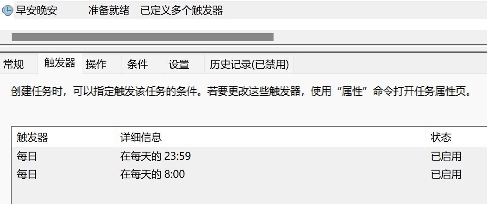

[[toc]]
## 微信定时问候

::: tip 基本思路
通过图片对比返回坐标点击，配合windows批处理脚本和定时任务运行
:::

### code
``` python
import subprocess
import time
from datetime import datetime
import pyautogui
import pyperclip
import logzero
from logzero import logger

# 配置日志记录器
logzero.logfile(r"C:\Users\wxm\log.txt")

user = "杨琦"

# 指定应用程序的路径（如果是一个可执行文件）
pathApp = r"C:\Program Files (x86)\Tencent\WeChat\WeChat.exe"

# 打开应用程序
subprocess.Popen(pathApp)

# 鉴于微信无法自动登录，需要手机确认，所以只考虑登录后在线操作

try:
    time.sleep(2)

    # 定位搜索框并点击
    path = r"C:\Users\wxm\search.png"
    x, y = pyautogui.locateCenterOnScreen(path)
    pyautogui.click(x, y)

    # 搜索用户并跳转
    pyperclip.copy(user)
    time.sleep(1)
    pyautogui.hotkey("ctrl", "v")
    pyautogui.click(x, y + 150)


# 抛出异常
except TypeError:
    logger.info("未找到用户")

try:
    while True:
        hours = datetime.now().hour
        if hours == 00:
            time.sleep(2)
            path = r"C:\Users\wxm\send.png"
            x, y = pyautogui.locateCenterOnScreen(path)
            pyautogui.click(x - 100, y - 100)

            # 输入文字
            pyperclip.copy('晚安')
            time.sleep(1)
            pyautogui.hotkey("ctrl", "v")

            # 按下回车键
            pyautogui.press("enter")
            logger.info("晚安！已经发送")
            pyautogui.press("Esc")
            break

        if hours == 8:
            time.sleep(2)
            path = r"C:\Users\wxm\send.png"
            x, y = pyautogui.locateCenterOnScreen(path)
            pyautogui.click(x - 100, y - 100)
            # 输入文字
            pyperclip.copy('早安')
            time.sleep(1)
            pyautogui.hotkey("ctrl", "v")

            # 按下回车键
            pyautogui.press("enter")
            logger.info("早安！已经发送")
            pyautogui.press("Esc")
            break

        else:
            current_datetime = datetime.now()
            current_datetime_str = current_datetime.strftime("%Y-%m-%d %H:%M:%S")
            logger.info("未到时间问候,睡眠中,当前时间：" + current_datetime_str)
            time.sleep(60)


except TypeError:
    logger.info("未找到输入框")
```


#### 添加到windows的定时任务


#### 执行bat脚本
```shell
@echo off
python C:\Users\wxm\weixin.py
```


### 优化bug
- 应用扫描找到微信路径
- 每个版本识别图标不一致
- 多人问候如何实现
- 加入当天的实时咨询以及对方的爱好
- 写成配置文件问候人
- 自己写一个web播放器，加入每日问候。薛之谦


### BUG
- 有时候无法执行，看日志是没有找到图像识别，有没有可能是延迟，我建议做很多次测试看看情况。是多次查找还是怎么滴
- 无法达成关闭再开机，必须要一直开机。
- 移植到其他电脑无法使用，图片和坐标都有问题。怀疑是图片识别策略问题，和全分辨率下的计算问题
- 步骤有时候有很多不同，该怎么解决呢